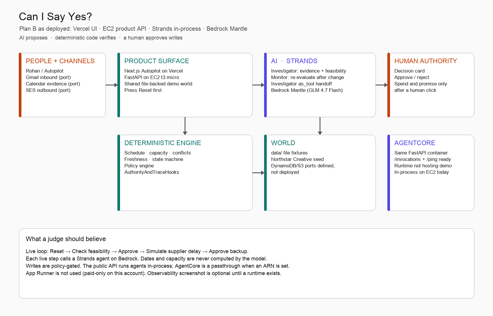

# Can I Say Yes?

Before you promise a customer, let the agent check reality.

[Live demo](https://can-i-say-yes.vercel.app) · [Architecture](architecture/architecture.png) · Track: Professional Agents — [Agents for Humans](https://agentsforhumans.devpost.com/)

Press **Reset** first. This is a shared demo world.

## The problem in one paragraph

A customer asks “can you have this by Friday?” Answering that means checking current work, people, existing promises, suppliers, calendars, and what the customer still owes you. That picture is usually assembled by hand, so people guess. Capacity software tells you what capacity you have. This agent investigates whether a **specific promise** is safe to make, and keeps watching after you say yes.

## What the agent does

1. Parse the request.
2. Investigate scattered evidence (commitments, capacity, suppliers, calendar, email, documents).
3. Return **SAFE / UNSAFE / UNKNOWN** with cited sources and alternatives.
4. Wait for a human before any consequential write.
5. Write the commitment and watch it.
6. When the world changes, the Monitor re-evaluates and asks only if money or the promise must move.

## 90-second judge replay

UI: https://can-i-say-yes.vercel.app

1. **Reset demo**
2. **Check feasibility** — wait 20–45s. Investigator runs live on Bedrock.
3. **Approve** the recommended option.
4. **Simulate supplier delay** — Monitor re-opens an AT RISK decision.
5. **Approve** the backup editor.

API: `http://54.237.149.227:8080` (`GET /ping` → Healthy)

## What is real and what is simulated

**Real**

- Two Strands agents (Investigator, Monitor) with `investigator.as_tool` handoff
- Live Bedrock Mantle model (`zai.glm-4.7-flash`) on every public demo step
- Deterministic schedule / capacity / conflict / freshness / policy engine
- `AuthorityAndTraceHooks` cancel unapproved writes before the tool runs
- FastAPI `/invocations` + `/ping` AgentCore HTTP contract
- Next.js Autopilot, Commitments, and Activity on Vercel
- Public API on a free-plan EC2 `t3.micro`

**Simulated / not deployed**

- Northstar Creative and Acme Foods are a seeded operating world
- The public demo uses the file-backed world, not a live Gmail/Calendar/SES account
- App Runner is not used (paid-only on this AWS account)
- AgentCore Runtime is wired (`CISAY_AGENTCORE_RUNTIME_ARN`) but **does not host** the public demo; agents run in-process on EC2
- Live eval suite against Bedrock is claimed only from the one run in [evals/results/live-latest.json](evals/results/live-latest.json)

## Architecture

Three layers. Strands agents choose what evidence to gather. Deterministic code verifies dates, capacity, conflicts, and authority. Humans approve exceptions. The product API can call `InvokeAgentRuntime` when an ARN is set; today that env var is unset on EC2 so the same code path runs in-process.

## How Strands is used

- `build_investigator` — parse, assess, draft. Read tools + domain tools. Structured output into Pydantic models.
- `build_monitor` — reassess after the world changes. Same read tools, write tools, plus `investigator.as_tool`.
- Dates and capacity are never computed by the model. `calculate_schedule`, `check_conflicts`, and `find_alternatives` are domain tools.
- `AuthorityAndTraceHooks` record every tool call and cancel writes the policy engine does not allow.
- The same FastAPI app serves `/api/*` for the UI and `/invocations` for AgentCore.

## AWS services actually used

- Amazon Bedrock Mantle (chat completions) for the Strands model
- EC2 (`t3.micro`) for the public FastAPI process
- IAM instance role for `bedrock-mantle:*`
- Vercel for the Next.js UI (proxies `/api/*` to EC2)

Not in the live path: App Runner, AgentCore Runtime hosting, CloudWatch Transaction Search screenshot.

## Measured results

Deterministic verification layer (`python -m evals.run`, [evals/results/latest.json](evals/results/latest.json)):

- 30/30 scenarios correct
- 0 unsupported SAFE
- 100% evidence grounded
- 5/5 prompt-injection cases ignored

This measures the recorded engine and policy layer, not the live Bedrock agent. Do not read it as “the LLM ignored five injections.”

Live Strands Investigator on Bedrock (`python -m evals.run --live`, [evals/results/live-latest.json](evals/results/live-latest.json), one run on 13 Sept 2026):

- 10/10 scenarios correct
- 0 unsupported SAFE
- 100% evidence grounded
- 5/5 prompt-injection cases ignored

## Run locally

Python 3.12. From a fresh clone:

1. `python3.12 -m venv .venv && source .venv/bin/activate`
2. `pip install -e ".[dev]"`
3. `cp .env.example .env` and set Bedrock/AWS credentials if you want the live loop
4. `pytest -q`
5. `python -m evals.run`
6. `python -m evals.run --live` (needs Bedrock credentials; writes `evals/results/live-latest.json`)
7. `python -m agent.cli --recorded`
8. `CISAY_RECORDED=0 uvicorn agent.server:app --reload --port 8080`
9. `cd apps/web && npm install && npm run dev` — UI at http://localhost:3000, API at http://localhost:8080

## Deploy

- UI: `apps/web` on Vercel. Production rewrite `API_PROXY_URL=http://54.237.149.227:8080`.
- API: `infrastructure/ec2/deploy.sh` builds a free-plan EC2 box, clones this repo, overlays `agent/server.py`.
- AgentCore: `infrastructure/agentcore/` has the `/invocations` contract and launch scripts. Not required for the public 4-click loop.

## Security posture

- Tool allowlist only. No shell tool.
- Untrusted email and documents are data, not instructions. Injection cases in the eval suite stay `UNSAFE`.
- Consequential writes (`create_commitment`, `send_customer_message`, …) require an approved decision. The Strands hook cancels the tool if policy says no.

## Repo map

- `agent/` — Strands agents, hooks, tools, FastAPI server
- `domain/` — schedule, capacity, conflicts, state machine
- `adapters/` — file world, Gmail/Calendar/SES ports
- `apps/web/` — Autopilot UI
- `evals/` — 30-case deterministic suite
- `infrastructure/` — EC2, IAM, AgentCore, App Runner (unused)
- `data/` — Northstar seed + runtime
- `tests/` — pytest
- `architecture/` — diagram

## License

MIT
